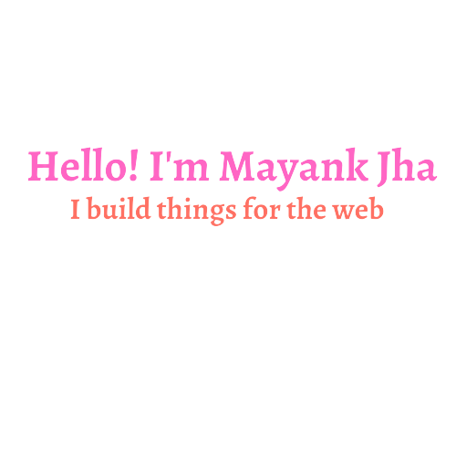

<!-- # Hey there 🙋‍♂️, I am Mayank Jha -->

❗️ This readme is under continuous improvements

I’m a web developer specialising in functionality implementation & bug fixing in
javascript based applications.

    

<!-- TODO: Organise this by https://rahuldkjain.github.io/gh-profile-readme-generator/ -->
<h2>🛠 Technical Skills</h2>
<h4>Programming languages:</h4>
<code>html</code> <code>css</code> <code>javascript</code> <code>typescript</code> <code>react</code> <code>nodejs</code> <code>graphql</code> <code>gatsby</code> <code>C++</code> <code>git</code> <code>github</code>
<h4>Backend development:</h4>
<code>html</code> <code>css</code> <code>javascript</code> <code>typescript</code> <code>react</code> <code>nodejs</code> <code>graphql</code> <code>gatsby</code> <code>C++</code> <code>git</code> <code>github</code>

<h2>👨🏻‍💻 About Me:</h2>

- 🌐 I build things for the web.

<h2>Let's Connect:</h2>

Email: contact@mayankjha.net

<!--
**mayankjhax/mayankjhax** is a ✨ _special_ ✨ repository because its `README.md` (this file) appears on your GitHub profile.

Here are some ideas to get you started:

- 🔭 I’m currently working on ...
- 🌱 I’m currently learning ...
- 👯 I’m looking to collaborate on ...
- 🤔 I’m looking for help with ...
- 💬 Ask me about ...
- 📫 How to reach me: ...
- 😄 Pronouns: ...
- ⚡ Fun fact: ...
-->
